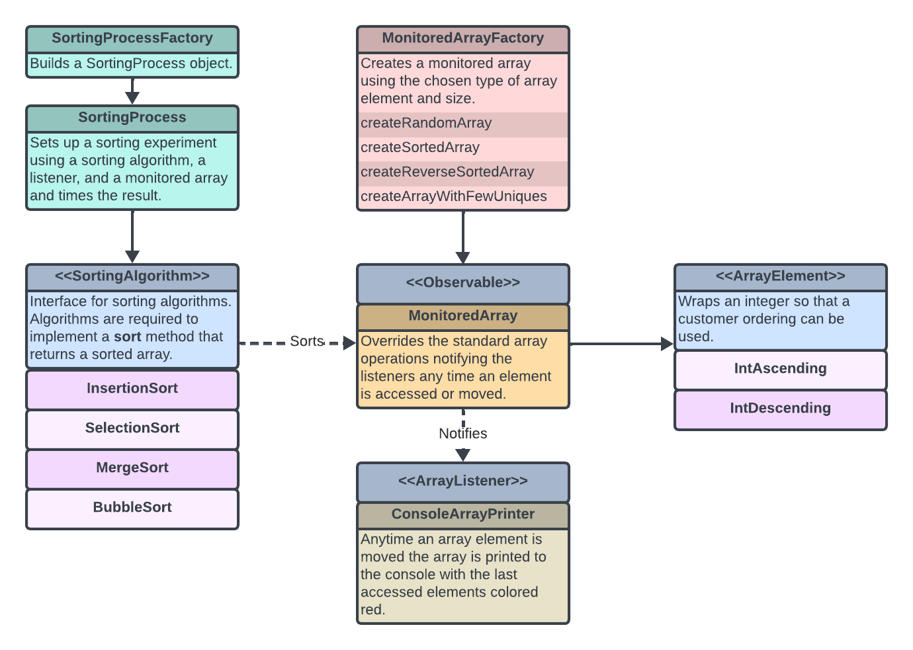

# Sorting-Visualizer
Simple sorting algorithm visualizer written in Kotlin.

## Overview

This project was created as a teaching aid for an introduction to algorithms course. Each sorting algorithm can be customized to sort in ascending or descending order depending on the type of element in the array. The algorithms sort a special monitored array. Any element updates or swaps trigger any registered listeners.

## Sorting Algorithms
All sorting algorithms implement the `sort` method, which takes an array to be sorted and returns the array in the correct sequence.

### Supported Algorithms
#### Insertion Sort
#### Selection Sort
#### Merge Sort
#### Bubble Sort

### Ordering Logic
The initial implementation for the sorting algorithms used an ordering logic that was applied through the strategy pattern so that it could be easily swapped during runtime. This was replaced with subtypes of `ArrayElement` that override the `compareTo` method to control the final sequence.

## Monitored Array
The sorts are applied to a monitored array object. Changes to the array trigger an update on the registered listeners, which can then render the array changes.

## Array Listeners
All listeners implement the `update` method and respond to changes to the array by creating some visualization step so that the sorting process can be observed.

### Console Array Printer
At each step in the sorting process the array is printed to the console.